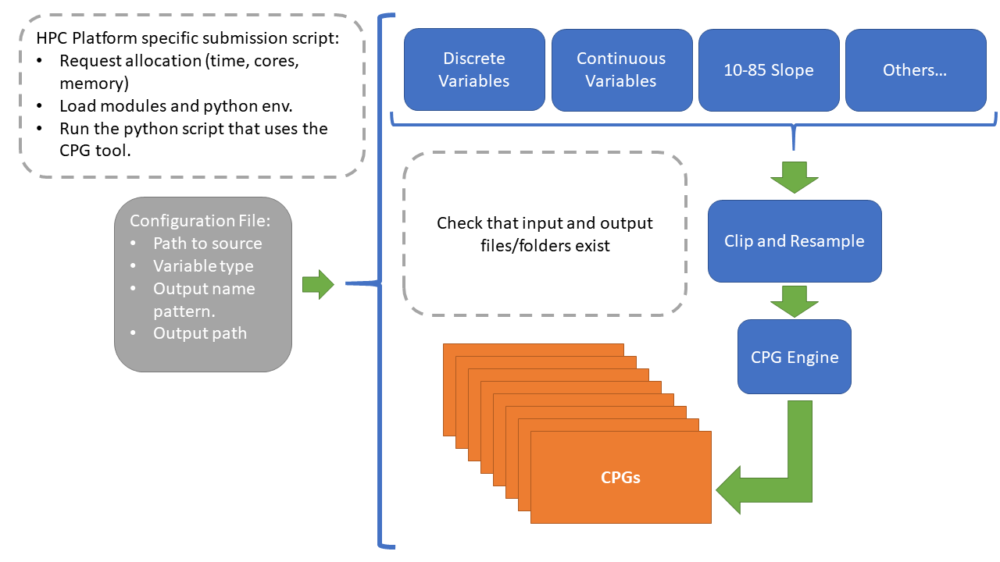

# StreamStats CPGtools
## Theodore Barnhart | tbarnhart@usgs.gov

Scripts to make headwaters continuous parameter grids (CPGs) by HUC2 regions for the Continental United States on Yeti.

### Current Usage:

`sbatch submit_make_cpg_tauDEM.sh <region>`

Where `<region` is the HUC2 region you would like to create CPGs for. The submission script will request a computing allocation from Yeti, initialize the correct computing environment, and run `make_cpg_tauDEM.py`.

### Configuration:

Edit `submit_make_cpg_tauDEM.sh` to change the number of nodes and cores you want to check out and the anticipated processing time.

Edit `make_cpg_tauDEM.py` to change where the script searches for input parameter datasets, flow accumulation grids (currently NHDv2.1), and flow direction grids (currently NHDv2.1).

### Dependencies:

Dependencies for this work are largely taken care of via the Module commands on Yeti executed in `submit_make_cpg_tauDEM.sh`; however, the user will need their own conda Python 3.6 environment on Yeti. Below is an outline of the general dependencies.

For CPGs Creation:

- TauDEM 5.3.8
- MPICH
- Python 3.6
- GDAL
- Rasterio
- Numpy
- Subprocess

For Gauge Snapping / basin delineation:

- All of the above
- GRASS 7.4 

### To Do:
- Functionize more of `make_cpg_tauDEM.py`
- Add search and FDR/FAC paths as inputs
- Break out CPG method into script separate from the library
- Write documentation

## Notes:
- Querying values from CPGs requires that your points of interest, particularly if they are stream flow gauges, are on the snapped to areas of high flow accumulation. There are GRASS GIS routines for this and some example scripts for this as well.

## Geographic Parameters:
- All datasets and processing is done in [EPSG:42303](https://epsg.io/42303)