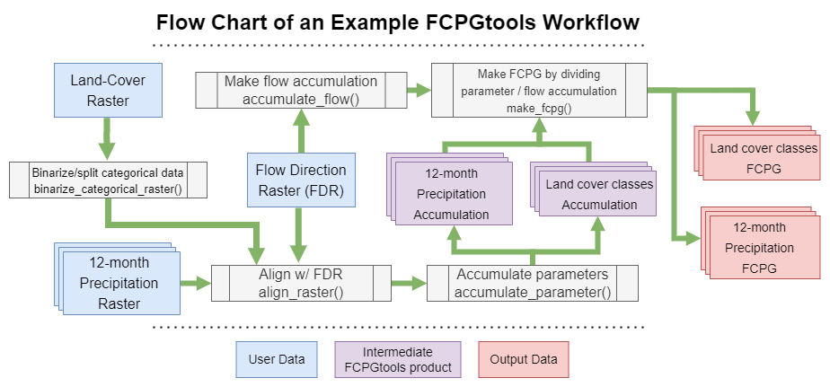

`FCPGtools` Documentation Site
==================================

The Flow-Conditioned Parameter Grid (FCPG) tools is a Python 3 library that 
enables users to quickly create FCPGs, as well other gridded output datasets, 
for use in statistical, machine learning, and physical hydrologic modeling. 
These tools use a Flow Direction Raster (FDR) and gridded parameter datasets, 
such as precipitation, slope, or land use, to generate seamless gridded outputs. 
Each cell in these outputs stores a value that statistically summarizes all 
upstream parameter values.

More specifically, a FCPG is a pre-processing method that stores the **upstream 
average of a parameter datasets for each grid cells in a landscape**. 
These tools allow you to store the upstream maximum and minimum parameter values, 
or to generate a FCPG with a decay factor that modifies the downstream 
accumulation calculation of the parameter.

For example, you could use these tools to calculate the average upstream 
precipitation value for each grid cell in a raster, or the maximum and minimum 
upstream slope values using a hillslope raster as the input parameter grid.

These types of gridded outputs are useful in a variety of hydrologic modeling 
applications and can serve as powerful predictive features in machine learning 
training datasets. This software package has previously been used to generate a 
seamless dataset of common basin characteristics for the contiguous United States, 
including mean upstream elevation, slope, minimum and maximum monthly temperature, 
annual precipitation, land cover class, and latitude.

Use and Citation
------------------
The FCPG Tools are part of the public domain as they are produced by 
employees of the U.S. Government in collaboration with private sector contractors. 
If you use these tools in your work, we request that you cite the latest 
release of the code using the provided citation. This helps us ensure that the 
contributions of the team behind the FCPG Tools are properly recognized, and 
will help justify the continued maintenance of this library.

* **Version 2.0** was released in December, 2022.
    * Barnhart, T.B., Nogueira, X.R., Siefken, S.A., Schultz, A.R., Aufenkampe, A., Tomasula, P., 2023, Flow-Conditioned Parameter Grid Tools Version 2.0.
* **Version 1.1** was released in September, 2022.
* **Version 1.0** (IP-112996) was approved on September 3, 2020.
    * Barnhart, T.B., Sando, R., Siefken, S.A., McCarthy, P.M., and Rea, A.H., 2020, Flow-Conditioned Parameter Grid Tools: U.S. Geological Survey Software Release, DOI: https://doi.org/10.5066/P9W8UZ47.

If you encounter and issues with this software, please bring it to our attention 
by filling out a 
`GitLab Issues Form <https://code.usgs.gov/StreamStats/FCPGtools/-/issues/new?issuable_template=new_project>`_.

.. toctree::
   :maxdepth: 2
   :caption: Contents

   getting_started
   functions
   cookbook
   migrating_from_v1
   custom_types
   contributions
   publications
   z_references

Site Index
-----------
* :ref:`genindex`
